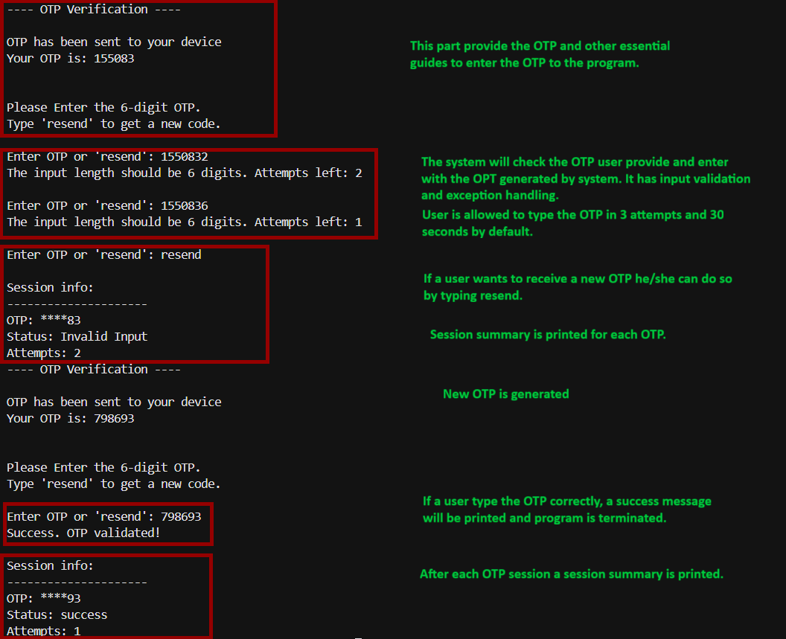
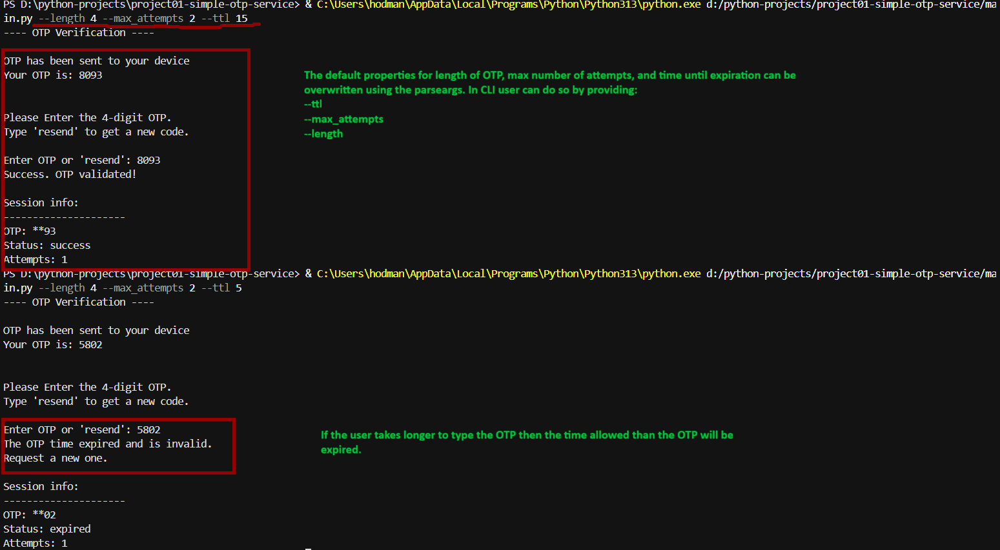

# OTP Verification System (CLI Tool)
A simple and practical Python project that simulates the OTP (One-Time Password) verification flow used in banking, authentication, password reset, and secure login systems.

This tool generates a random numeric OTP, sends it to the user (prints it in the console - no GUI, SMS or email sending), and validates the user input with attempt limits and optional time-based expiration.
It is designed for learning Python fundamentals: loops, conditionals, random module, input handling, file operations, and basic system design.

## Features
- Generate 4 digit numeric OTPs
- Limit validation attempts
- Optional time-based OTP expiration
- resend command to generate a new OTP
- Input validation (numbers only)
- Optional session logging into a file
- Configurable settings via CLI parameters (advanced)

## How to Run
1. Clone the repository
```
    git clone https://github.com/hodmanmusa/otp-verification-system.git
    cd otp-verification-system
```
2. python otp_verification/main.py
```
    python otp_verification/main.py
```
3. Optional - Run with custom settings 
```
    python otp_verification/main.py --length 4 --max-attempts 5 --ttl 45
```
## Learning Goals
- How to use random numbers
- How to apply basic security concepts
- How to use time module for expiration
- How to use file handling for logs
- How to use argparse for creating an interactive CLI app

## Sample Output 
### This example shows how the program runs using its default arguments.


### The screenshot below shows how to use the program with arguments passed while running program from CLI. 


## Project Structure 
```
project01-simple-otp-system/
│-- assets/
│     ├-- default_output.png
│     ├-- parse_args.png
│-- logger.py
|-- main.py
|-- utils.py
│-- README.md
│-- otp_log.txt

```